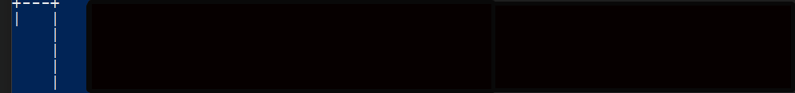
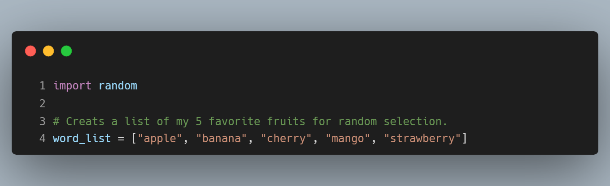
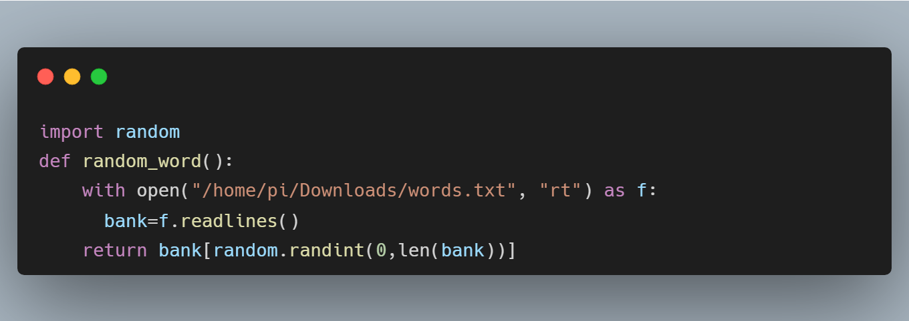
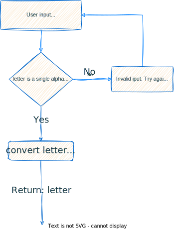
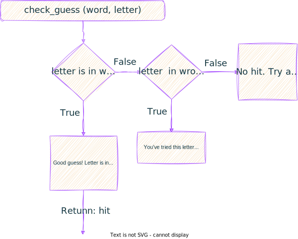
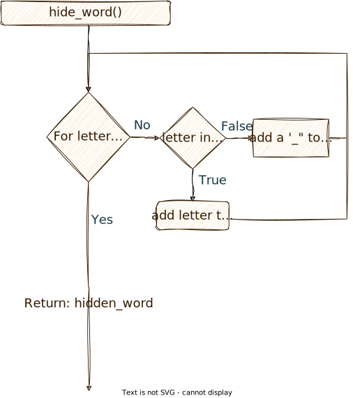
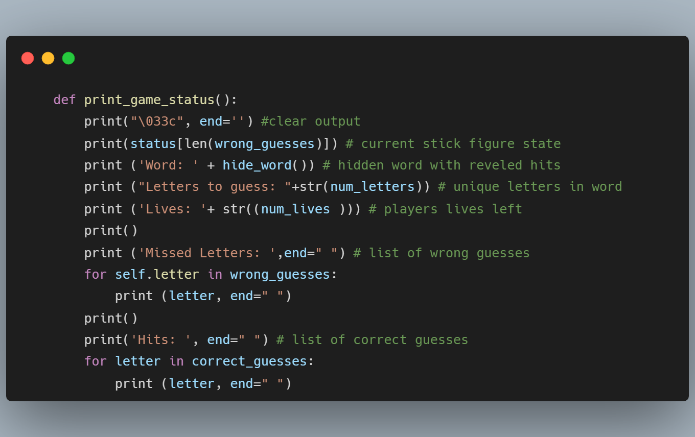
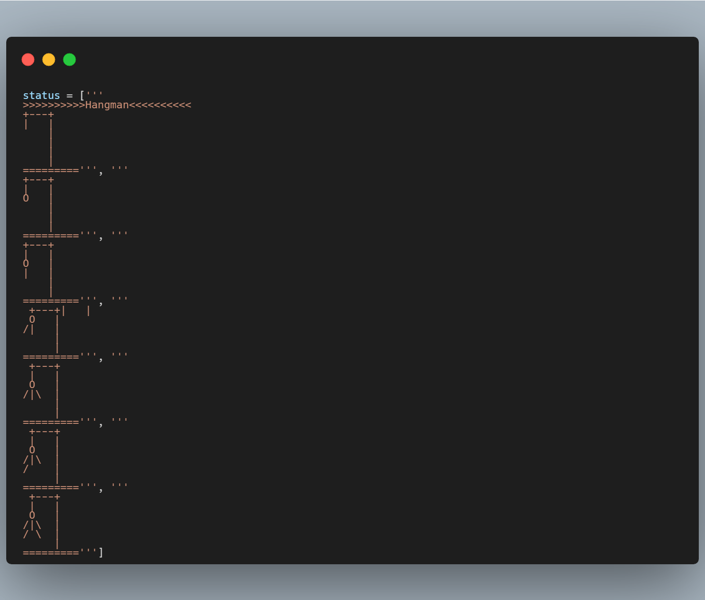
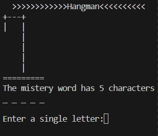

# Hangman
      __      __         __         __      __     _________    __          __          __         __      __ 
     |  |    |  |      /    \      |   \   |  |  /  ________|  |   \      /   |       /    \      |   \   |  | 
     |  |____|  |     /  /\  \     |    \  |  | |  |_________  |    \    /    |      /  /\  \     |    \  |  |
     |   ____   |    /  /__\  \    |     \ |  | |   ______   | |     \  /     |     /  /__\  \    |     \ |  |
     |  |    |  |   /   ____   \   |  |\  \|  | |  |      |  | |  |\  \/  /|  |    /   ____   \   |  |\  \|  |
     |  |    |  |  /  /      \  \  |  | \     | \  |______|  | |  | \    / |  |   /  /      \  \  |  | \     |
     |__|    |__| /__/        \__\ |__|  \____|  \___________| |__|  \__/  |__|  /__/        \__\ |__|  \____|

 
**Table of Contents** 
- [Description](#description)
     - [The Game](#the-game)
     - [Our Version](#our-version)
     - [Why Hangman ?](#why-hangman)
- [Implementation](#implementation)
     - [Milestones](#milestones)
          - [Milestone 1](#milestone-1)
                    - [Choose a word.](#choose-a-word)
          - [Milestone 2](#milestone-2)
                    - [Attempt to guess a letter.](#attempt-to-guess-a-letter)
          - [Milestone 3](#milestone-3)
                   - [Conduct necessary checks.](#conduct-necessary-checks)
          - [Milestone 4](#milestone-4)
               - [Hide the word](#hide-the-word)
               - [Draw the stick figure](#draw-the-stick-figure)
               - [Game over](#game-over)
     - [Putting everything together into the Hangman class](#putting-everything-together-into-the-hangman-class)
- [Project Files Description](#project-files-description)
- [Game Play](#game-play)
      - [To play Hangman](#to-play-hangman)
- [License](#license)

<h2 id="description">Description</h2>
Hangman is a classic game in which a player thinks of a word and the other player tries to guess that word within a certain amount of attempts.

This is an implementation of the Hangman game, where the computer thinks of a word and the user tries to guess it.

#### The Game
Hangman is a word guessing game that can be played by two or more players. One player thinks of a word, phrase, or sentence and the other players try to guess it by suggesting letters within a certain number of guesses. The game is typically played with a paper and pencil, where a stick figure is drawn for each wrong guess. The game ends when the players correctly guess the word or the stick figure is completely drawn.
#### Our Version
We have implemented a version of the Hangman game where the computer randomly selects a word from a list and displays it as a hidden word using underscore characters '_'. The computer also provides information about the number of unique letters in the word, a list of correct and wrong attempts, and the number of attempts left.

For each wrong guess, a part of the stick figure is drawn until the game ends either when the user guesses the word correctly or the stick figure is completely drawn.

#### Why Hangman ?
Playing the Hangman game is a great way to practice object-oriented programming concepts in Python. It helps in understanding how to use classes effectively and provides hands-on experience in implementing production code for the class. We have documented every step of the development process with detailed explanations, flowcharts, and code examples to enhance understanding.

<h2 id="implementation">Implementation</h2>

Our approach involved dividing the game implementation into four parts. First, we identified important milestones in the game flow that needed to be implemented. Then, we wrote separate functions to achieve these milestones. After completing the functions, we refactored the code to improve readability and comprehension. Finally, we collected all the functions into the Hangman class and wrote the production code.
### Milestones 

|Milestones | Description|
:----------|:-----------|
`Choose a word.`| Choose a word at random from the provided list of words.
`Attempt to guess a letter`|Prompt the user for input and validate it.
`Conduct necessary checks`| Determine the outcome by checking if the guess is correct or incorrect, and adjust the player's remaining lives accordingly. Additionally, update the count of unique letters in the word. 
`Develop the gameflow` | Establish the conditions for winning or losing the game. Implement a strategy to conceal the word and unveil successful guesses. Lastly, provide a report on the current progress and display the stick figure.

## Milestone 1
###  Choose a word.

To randomly select a word, we created a list of words and used Python's random library to choose a word from the list. Alternatively, the list of words can be read from a file.
>
>  ```list of words (Version 1)```:
> <p align="center">
>
> 
> </p>
> 
> ```list of words (Version 2)```:
> <p align="center">
>
> 
> </p>
>
## Milestone 2
###  Attempt to guess a letter.

To ask the user for input, we created a function that verifies if the input is a single alphabetical character. We also ensured that the character is in the correct format (string, lowercase) for further processing.
> 
> ```Ask for user input```:
> <div>
> <p align="right">
> 
>
> </p>
> </div>
>
> **Figure 1.** Flow chart represents the ask_for_input() function. A while-loop checks the length and alphabetical format of the user's input. Exiting the loop converts the letter into a lower case string. (Diagram was generated using: https://app.diagrams.net)

## Milestone 3
### Conduct necessary checks.

We developed functions to check the user's guess. The input from the user is checked to determine if it is present in the word and if it has been guessed correctly before. Based on the result, the function updates the list of correct and wrong guesses and adjusts the number of remaining lives and unique letters accordingly.
> ```Check the user input```
> <p align="center">
>
>  
>
> **Figure 2.** Flow chart representation of the check_guess() function: Correct guesses are added to the correct_guesses list, while wrong guesses are added to the wrong_guesses list. The num_lives and num_letters variables are reduced by 1 for a miss or a hit, respectively. (Diagram was generated using: https://app.diagrams.net)
> </ul>
> </p>
## Milestone 4
### Hide the word

To hide the word and gradually reveal correct guesses, we created a function that replaces the letters in the word with either correct guesses or underscore characters. Additionally, we implemented functions to determine when the game is won or lost, display the current game status, and draw the stick figure based on the number of wrong guesses.
> ```Hide the word```
> <p align="center">
>
>  
>
> **Figure 3.** Shows the flow chart representation of the hide_word() function. A for-loop is used to reveal correct words and replace the remaining letters with '_' characters. (Diagram was generated using: https://app.diagrams.net)

### Draw the stick figure
The reamining game flow must correctly end the game and draw the stick figure in case of a miss.The game is won when the hidden word is revealed and lost when the player has used up all life. To achieve this, we wrote four functions.

- **print_game_status()**: Function clears the screen and displays information about the correct and wrong guesses so far, the remaining lives, and the remaining letters to guess. The correct stick figure state index is selected from a list of six states, which is created as a global variable called 'status'.
> ```Print current game status```
> <p align="center">
>
>  
>

> ```Stick states as list ```
> <p align="center">
>
>  
>
>
### Game over
-  **hangman_winner()**: Function returns 'True' if the hidden_word does not contain any underscore characters.
- **hangman_looser():**: Function returns 'True' when the player has used all of their lives (num_lives == 0).
- **hangman_game_over()**: Function returns 'True' if either hangman_winner() or hangman_looser() is true; otherwise, it returns 'False'. This allows the game flow to loop until this function becomes 'True'.
> ```Game Over```
> <p align="center">
>
>  
>
> **Figure 5.** Illustrates the flow chart representation of hangman_game_over(), hangman_winner(), and hangman_looser(). The game is over when either of these functions returns 'True'. The game is lost if num_lives == 0 and won if the hidden_word variable contains no more '_' characters. (Diagram was generated using: https://app.diagrams.net)

## Putting everything together into the Hangman class

All the functions are collected in the Hangman class, which takes the randomly selected word as input.
> ```Hangman class```
> <p align="center">
>
>  
>
<h2 id="file-structure">Project Files Description</h2>

<p>This project includes three executable files:</p>
<ul>
  <li><b>milestones.py</b> - This file contains the main development process where the milestones were achieved. It includes the completed Hangman class and the production code.</li>
  <li><b>hangman_Template.py</b> - This file uses a template code defined by the AICore team to create the final production code.</li>
  <li><b>hangman.py</b> - The final production code, compiled from hangman_Template.py and milestones.py.</li>
</ul>

<ul>
The project also includes a "pics" directory that contains figures used in this document.
</ul>

<h2 id="gameplay">Game Play</h2>

> ```start: python hangman.py```
> <p align="center">
>
>  
>
#### To play Hangman
1. Start the game by typing python hangman.py into the console.
2. You will see the ">>>>>>>>HANGMAN<<<<<<<<<<" banner at the start of the game.
3. To make a guess, enter a single alphabetical letter after the prompt "Enter a single letter:".
4. Each attempt will either reveal correct letters or deduct one life, causing the stick figure to progress.
5. The game is won once all letters of the mistery word have been guessed and lost if the stick figure has been hung.
 
Enjoy :)


<h2 id="license">License</h2>

This is an open, unlicensed repository. You are free to utilize the content of this repository for any purpose you desire. Please maintain a professional tone and refrain from including any additional text before or after. 