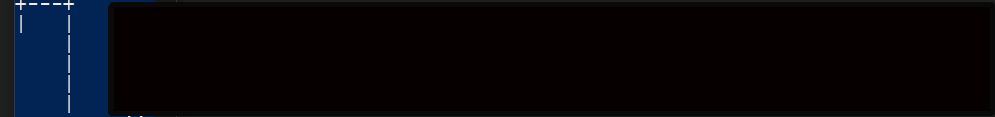

# Hangman
Hangman is a classic game in which a player thinks of a word and the other player tries to guess that word within a certain amount of attempts.

This is an implementation of the Hangman game, where the computer thinks of a word and the user tries to guess it. 

<!Project Title
Table of Contents, if the README file is long
- A description of the project: what it does, the aim of the project, and what you learned
- Installation instructions
- Usage instructions
- File structure of the project
- License information>

      __      __         __         __      __     _________    __          __          __         __      __ 
     |  |    |  |      /    \      |   \   |  |  /  ________|  |   \      /   |       /    \      |   \   |  | 
     |  |____|  |     /  /\  \     |    \  |  | |  |_________  |    \    /    |      /  /\  \     |    \  |  |
     |   ____   |    /  /__\  \    |     \ |  | |   ______   | |     \  /     |     /  /__\  \    |     \ |  |
     |  |    |  |   /   ____   \   |  |\  \|  | |  |      |  | |  |\  \/  /|  |    /   ____   \   |  |\  \|  |
     |  |    |  |  /  /      \  \  |  | \     | \  |______|  | |  | \    / |  |   /  /      \  \  |  | \     |
     |__|    |__| /__/        \__\ |__|  \____|  \___________| |__|  \__/  |__|  /__/        \__\ |__|  \____|


 
 
 
<div align="center">
<a href="#description"> Description</a> •
<a href="#installation"> Installation</a> •
<a href="#getting-started"> Getting Started</a> •
<a href="#file-structure"> File structure</a> •
<a href="#license"> License</a>
</div>
</Br>
<!-- 
Check out the site live at:  [](https://sr6033.github.io/lterm/)	[](https://gitter.im/lterm/Lobby?utm_source=share-link&utm_medium=link&utm_campaign=share-link)
-->
<h2>Description</h2>
<h2 id="installation">Installation</h2>
- If a **command** doesn't need further steps:

```
// without argument
ls: function() {
        this.echo('This is the ls command\n');
}
```

```
// with argument
echo: function(arg1) {
        this.echo('This is the echo command' + arg1 + '\n');
}
```

- If a **command** needs further steps:

```
cd: function(arg1) {
	this.push(function(cmd, term) {
                if(cmd == 'another_command')
                    this.echo('another_command');
		}, {
                    prompt: '[[b;#44D544;]lterm@localhost/' + arg1 + ':~$] ',
                   }
        );
}
```


<p>This Project includes 3 executable files, 3 text files as well as 2 directories as follows:</p>
<h4>Executable Files:</h4>
<ul>
  <!--<li><b>spam_detector.py</b> - Includes all functions required for classification operations.</li>
  <li><b>train.py</b> - Uses the functions defined in the spam_detector.py file and generates the model.txt file after execution.</li>
  <li><b>test.py</b> - Uses the functions defined in the spam_detector.py file and, after execution, generates the result.txt as well as evaluation.txt files.</li>
  -->

  Command| Does...
:-----:|:-----:
`echo`|To display a string
`pwd`|Shows you the present working directory
`ls`|Lists all the files
`cd`|To change directory - change the current working 
</ul>

<h4>Output Files:</h4>
<ul>
  <li><b>model.txt</b> - Contains information about the vocabularies of the train set, such as the frequency and conditional probability of each word in Spam and Ham classes.</li>
  <li><b>result.txt</b> - Contains information about the classified emails of the test set.</li>
  <li><b>evaluation.txt</b> - Contains evaluation results table as well as Confusion Matrix of Spam and Ham classes.</li>
</ul>

<h2 id="file-structure">Project Files Description</h2>

<h4>Source Directories:</h4>
<ul>
  <li><b>train directory</b> - Includes all emails for the training phase of the program.</li>
  <li><b>test directory</b> - Includes all emails for the testing phase of the program.</li>
</ul>

<h2> List of commands available presently</h2>
<!-- 
Command| Does...
:-----:|:-----:
`echo`|To display a string
`pwd`|Shows you the present working directory
`ls`|Lists all the files
`cd`|To change directory - change the current working directory to a specific directory
`cd ..`|Moves you up one directory(parent)
`cat`|Concatenate and print the content of files
`clear`|Clears the terminal screen
`touch`|Changes file timestamps or creates a new file
`cp`/`mv`|To copy/move files
`rm`|Delets a file/directory
`uname`|Shows the name of the Linux/Unix system you are using
`date`|Shows the local standard date & time
`ifconfig`|Shows information about active network interfaces.
`mkdir`|Creates a new directory
`tty`|Prints the file name of the terminal connected to standard input
`history`|Shows all the commands which are used in the previous iterations
-->
### List of commands that can be added

- `export`
- `less`
- `more`

<h2 id="getting-started">Getting Started</h2>


1. Fork it (<https://github.com/sr6033/lterm/fork>)
2. Create your feature branch (`git checkout -b feature/fooBar`)
3. Commit your changes (`git commit -am 'Add some fooBar'`)
4. Push to the branch (`git push origin feature/fooBar`)
5. Create a new Pull Request

#### To add your new commands
- edit the file **<a href="https://github.com/sr6033/lterm/blob/master/js/main.js">main.js</a>** to add your commands.
- You don't have to worry about any other files or programs.

<h2 id="license">License</h2>

- On addition of a new **command**, increase the size of `arr` array. This array acts like a counter to check if a **task/command** is completed or not.
- You need to add the new **command** into the second array `arr2` . This array stores all the commands and helps in fetching the **completed commands** when the **history** command is executed.
- Please make sure that you **do not alter the positions of commands** in `arr2`, You need to add the new command towards the last.
- Example: If I add the command - `echo`. I will add another 0 to the end of `arr`. Then I will make `arr[index] = 1` under `echo` command.
```
var arr = [0,0,0,0,0,0,0,0,0,0,0,0,0,0]; // Will add another 0 here. The place where you added is the index.
var arr2 = ['list of all other commands']; // Will add the 'echo' command here
...
...
echo: function(arg1) {
            arr[index_where_you_added_0] = 1;	// Will make the value at that index to 1. 	
            this.echo(arg1 + '\n');
            this.echo('> The [[b;#ff3300;]echo] command prints back your arguments.');
            this.echo('> Type [[b;#ff3300;]help] and check your first task is completed.');
            this.echo('> Now type [[b;#ff3300;]pwd] to continue.');
},

```
- If you face any problem or cannot understand anything, open up an **issue**.
- You can also edit the **readme** and make it more user friendly to help out new contributors.

> **NOTE: Kindly keep the display of the terminal intact while making an update. A single extra space can make the look of the emulator little odd. So keep that in mind while printing something using `echo` command.**

> Note: Kindly have interpretable & good commit messages. Don't assume me to be some **Jedi** with powers to be able to make out every commit with a single word as message.
*May the Force be with you.*
